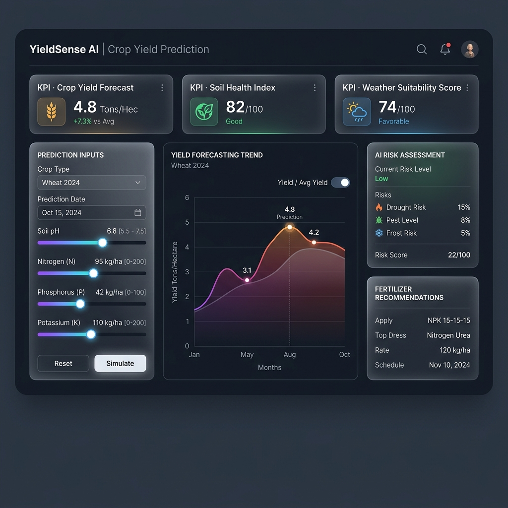
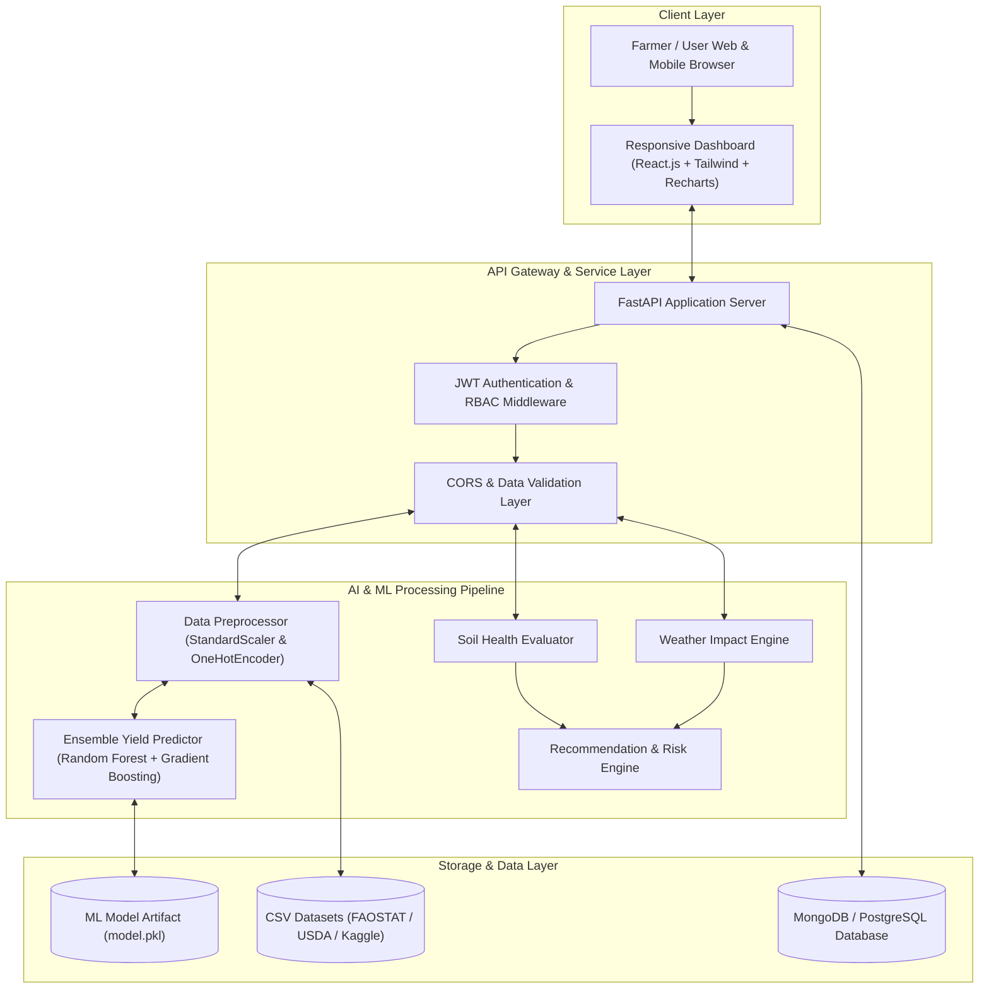
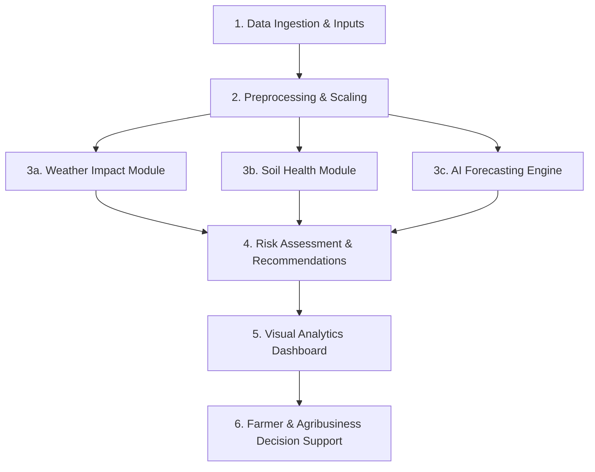

# YieldSense AI: Crop Yield Prediction & Agricultural Productivity Forecasting System

**YieldSense AI** is an end-to-end, AI-powered agricultural intelligence platform designed to empower farmers, agricultural cooperatives, agribusinesses, researchers, and government agricultural bodies to estimate future crop yields, analyze weather and soil characteristics, optimize resource allocation, and mitigate climate risks.

---

## 🎨 1. UI Wireframes & Layout Architecture



---

## 🎯 2. Project Objectives

### Primary Goals
1. **Accurate Crop Yield Forecasting**: Predict expected harvest yield (in `kg/ha` and total `tonnes`) based on historical farming records, weather parameters, and soil nutrients using Machine Learning (Random Forest & XGBoost / Gradient Boosting).
2. **Soil Health Assessment**: Evaluate NPK ratios (Nitrogen, Phosphorus, Potassium), organic matter percentage, and soil pH level to produce actionable soil fertility scores and fertilizer recommendations.
3. **Weather Impact Analysis**: Analyze precipitation, temperature trends, and climate risks to calculate weather suitability metrics for different crops across growing seasons.
4. **Data-Driven Farming Recommendations**: Generate crop selection advice, optimal irrigation scheduling, and risk mitigation strategies to maximize productivity and reduce crop loss.
5. **Centralized Interactive Dashboards**: Provide visual analytics for seasonal performance monitoring, productivity tracking, and regional farm comparisons.

---

## 🏗️ 3. System Architecture



---

## 🗄️ 4. Database Schema Design

The system uses a document/relational database schema structured around 5 primary entities:

### 1. `users` Collection / Table
* `_id` / `id`: Unique user identifier (UUID / ObjectId)
* `name`: Full name
* `email`: User email address (Indexed, Unique)
* `hashed_password`: Hashed credentials (`bcrypt`)
* `role`: Access role (`farmer`, `agronomist`, `admin`, `cooperative`)
* `region`: Operating agricultural region
* `created_at`: Registration timestamp

### 2. `farms` Collection / Table
* `_id` / `id`: Farm record ID
* `user_id`: Reference to owner `users.id`
* `farm_name`: Name of field / farm
* `region`: Region / Location
* `area_hectares`: Land area size
* `soil_type`: Soil texture (`Loamy`, `Clay`, `Sandy`, `Black`, etc.)
* `irrigation_type`: Irrigation system (`Rainfed`, `Drip`, `Canal`, `Sprinkler`)
* `primary_crops`: List of cultivated crops

### 3. `yield_predictions` Collection / Table
* `_id` / `id`: Prediction record ID
* `user_id`: Reference to `users.id`
* `crop`: Target crop name
* `region`: Farm region
* `season`: Cultivation season (`Kharif`, `Rabi`, `Zaid`)
* `area_hectares`: Cultivated area size
* `rainfall_mm`: Annual/seasonal precipitation ($mm$)
* `temperature_celsius`: Average ambient temperature (°C)
* `soil_ph`: Measured soil pH
* `nitrogen_n`: Soil Nitrogen ($kg/ha$)
* `phosphorus_p`: Soil Phosphorus ($kg/ha$)
* `potassium_k`: Soil Potassium ($kg/ha$)
* `predicted_yield_kg_ha`: AI-predicted yield ($kg/ha$)
* `total_production_tonnes`: Total expected harvest ($tonnes$)
* `productivity_score`: Overall score ($0 - 100$)
* `created_at`: Timestamp of inference

### 4. `soil_assessments` Collection / Table
* `_id` / `id`: Soil assessment record ID
* `region`: Region name
* `soil_ph`: Soil pH
* `npk_ratio`: Measured N-P-K concentration
* `soil_health_score`: Score ($0 - 100$)
* `fertility_status`: `Optimal`, `Fair`, or `Suboptimal`
* `recommendations`: List of corrective actions / fertilizers

### 5. `weather_logs` Collection / Table
* `_id` / `id`: Weather entry ID
* `region`: Agricultural zone
* `season`: Season identifier
* `rainfall_mm`: Historical/forecasted rainfall
* `temperature_celsius`: Temperature
* `humidity_percent`: Humidity percentage
* `drought_risk`: Risk classification (`Low`, `Moderate`, `Severe`)

---

## 🔄 5. Agricultural Forecasting Workflows



---

## 🛠️ 6. Technology Stack

* **Backend API**: Python, FastAPI, Uvicorn, Pydantic, PyMongo, JWT
* **AI & Data Science**: Scikit-Learn, XGBoost, Pandas, NumPy, Joblib
* **Frontend Web App**: React.js (Vite), Tailwind CSS, Recharts, Lucide-React
* **Database**: MongoDB / PostgreSQL
* **DevOps & Containerization**: Docker, Docker Compose

---

## 🚀 7. System Quickstart

### Backend Setup
```bash
cd backend
source venv/bin/activate
pip install -r requirements.txt
python ml/train_model.py
uvicorn app:app --reload
```

### Frontend Setup
```bash
cd frontend
npm install
npm run dev
```
