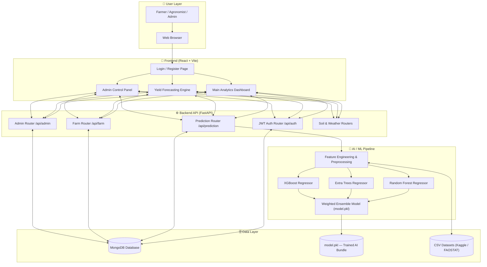
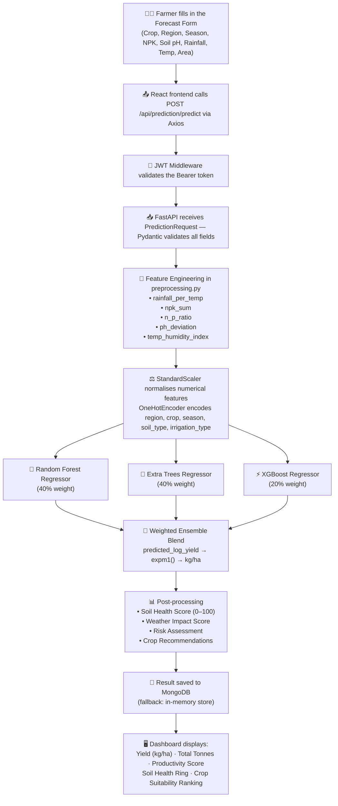
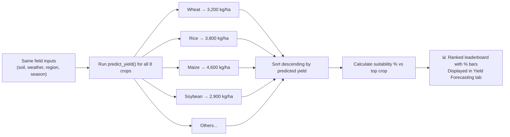
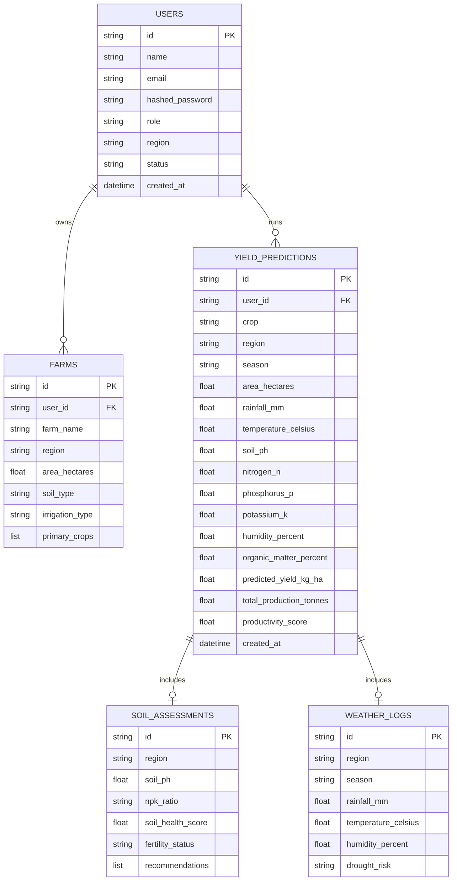
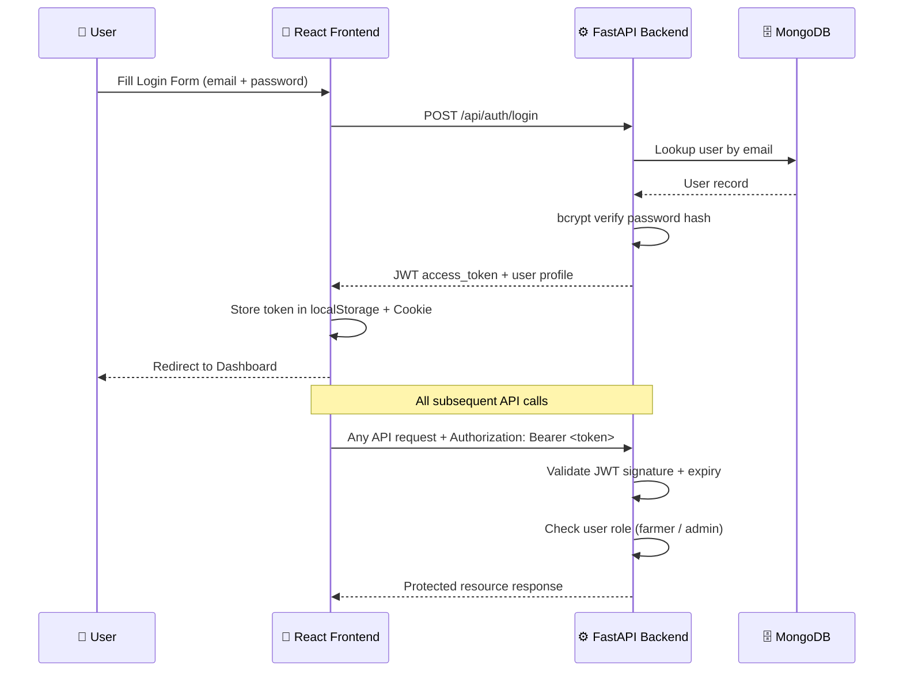

# 🌾 YieldSense AI — Crop Yield Prediction & Agricultural Productivity Forecasting System

> **Built by Yashraj** · Full-Stack AI Platform · React + FastAPI + Machine Learning

---

**YieldSense AI** is a complete, production-ready agricultural intelligence platform that I built from the ground up. The idea is simple: farmers and agribusinesses shouldn't have to guess what their harvest will look like. They deserve real data-driven forecasts. This system takes in soil measurements, weather conditions, and farming parameters — and returns accurate, AI-powered crop yield predictions in real time.

At its heart, it's a 3-in-1 platform — a crop yield forecasting engine, a soil health analyser, and a crop recommendation system — all wrapped inside a beautiful, interactive dashboard.

---

## 🎯 What This Project Actually Does

Farmers and agricultural researchers can:

- **Run yield forecasts** — Enter soil data, weather conditions, crop type, and region to instantly get an AI prediction of expected harvest in `kg/ha` and total `tonnes`.
- **See which crop to grow** — The system runs predictions across all 8 supported crops (Wheat, Rice, Maize, Soybean, Cotton, Barley, Sugarcane, Potato) and ranks them by predicted yield for the same field inputs. This tells a farmer which crop will give the most output this season.
- **Monitor Soil Health** — A live Soil Health Index card evaluates NPK ratios, soil pH, and organic matter against agronomic targets. A donut ring shows the overall score out of 100.
- **Track prediction history** — Every forecast is saved with full metadata. Users can search, filter, and export their history as a CSV file.
- **Admin oversight** — An admin panel allows approving/rejecting new user registrations, viewing platform-wide stats, and managing farmer accounts.

---

## 🏗️ How the System is Structured

Here's a high-level view of how all the pieces connect:



---

## 🔄 End-to-End Prediction Workflow

This is the step-by-step journey of a single yield prediction request — from the farmer clicking "Run Forecast" to receiving a result:



---

## 🤖 ML Crop Recommendation Flow

When a farmer asks "which crop should I grow?", the system doesn't guess — it runs the AI model 8 times (once per crop) and returns a ranked leaderboard:



---

## 🧠 The Machine Learning Model — How It Was Built

The AI model is an **ensemble of three algorithms** trained on crop yield datasets combining FAOSTAT records and Kaggle agricultural data:

| Component | Algorithm | Role | Weight |
|---|---|---|---|
| **Model 1** | Random Forest Regressor | Handles categorical patterns, regions, seasons | 40% |
| **Model 2** | Extra Trees Regressor | Reduces variance through extreme randomization | 40% |
| **Model 3** | XGBoost / Gradient Boosting | Captures complex non-linear feature interactions | 20% |

**Target variable**: `log1p(yield_kg_per_ha)` — log-transformed to normalize the highly skewed yield distribution. Predictions are converted back with `expm1()`.

**Feature Engineering** — The model sees 14 features total, including 5 engineered ones:

| Feature | How it's calculated | Why it matters |
|---|---|---|
| `rainfall_per_temp` | `rainfall / (temp + 1)` | Captures water-heat balance |
| `npk_sum` | `N + P + K` | Total soil nutrient load |
| `n_p_ratio` | `N / (P + 1)` | Nitrogen-phosphorus balance |
| `ph_deviation` | `abs(pH - 6.8)` | Penalty for pH away from the ideal neutral |
| `temp_humidity_index` | `temp × (humidity / 100)` | Heat-moisture stress index |

**Hyperparameter Tuning**: Random Forest was tuned using `RandomizedSearchCV` with 5-fold cross-validation over `n_estimators`, `max_depth`, and `min_samples_leaf`.

**Model Persistence**: The trained bundle (`preprocessor + rf_model + et_model + boost_model + metrics`) is serialized as `backend/ml/model.pkl` using `joblib`.

---

## 🛠️ Technology Stack

| Layer | Technology | Why |
|---|---|---|
| **Frontend** | React 19 + Vite | Fast SPA with HMR during development |
| **UI Styling** | Tailwind CSS (via CDN classes) | Utility-first, responsive, no CSS bloat |
| **Charts** | Recharts | Declarative chart components for bar/line charts |
| **Icons** | Lucide React | Consistent, lightweight icon set |
| **HTTP Client** | Axios | Auto JWT header injection via request interceptors |
| **Backend** | Python + FastAPI | Async REST API, auto Swagger docs at `/docs` |
| **ML** | scikit-learn + XGBoost + joblib | Ensemble model training, serialization, inference |
| **Data Processing** | Pandas + NumPy | Dataset cleaning, feature engineering |
| **Auth** | JWT (python-jose) + bcrypt | Stateless token auth with hashed passwords |
| **Database** | MongoDB (pymongo) | Flexible document store + in-memory fallback |
| **ASGI Server** | Uvicorn | Production-grade async Python server |

---

## 📁 Project Structure

```
CropYield/
├── backend/
│   ├── app.py                    # FastAPI application entry point
│   ├── main.py                   # Uvicorn runner
│   ├── requirements.txt          # Python dependencies
│   ├── database/
│   │   └── db.py                 # MongoDB connection manager
│   ├── models/                   # Pydantic data models
│   │   ├── user.py
│   │   ├── prediction.py
│   │   ├── farm.py
│   │   ├── crop.py
│   │   ├── soil.py
│   │   └── weather.py
│   ├── routes/                   # API route handlers
│   │   ├── auth.py               # Register, Login, Google OAuth, JWT
│   │   ├── prediction.py         # Yield prediction + crop recommendation
│   │   ├── farm.py               # Farm CRUD operations
│   │   ├── recommendation.py     # Agronomic recommendation engine
│   │   ├── admin.py              # Admin stats, user approval/rejection
│   │   ├── soil.py               # Soil health assessment
│   │   ├── weather.py            # Weather analysis
│   │   └── user.py               # User profile management
│   └── ml/
│       ├── train_model.py        # Model training script
│       ├── predict.py            # Inference engine
│       ├── preprocessing.py      # Feature engineering + scaling pipeline
│       └── model.pkl             # Serialized trained ensemble (36MB)
│
├── frontend/
│   ├── index.html
│   ├── vite.config.js
│   ├── package.json
│   └── src/
│       ├── main.jsx              # React app entry
│       ├── App.jsx               # Main application (~3100 lines — core dashboard)
│       ├── api.js                # Axios client + all API functions
│       ├── index.css             # Global styles + Tailwind config
│       └── components/
│           ├── LoginPage.jsx     # Auth login with Google OAuth
│           └── RegisterPage.jsx  # Multi-step registration form
│
├── datasets/
│   ├── yield_df.csv              # Core crop yield training data
│   ├── Crop_recommendation.csv   # NPK-based crop suitability data
│   └── climate_change_impact_on_agriculture_2024.csv
│
├── docs/
│   └── assets/
│       └── yieldsense_ui_wireframe.png
│
└── README.md
```

---

## 🔌 API Endpoints Reference

| Method | Endpoint | Description |
|---|---|---|
| `POST` | `/api/auth/register` | Register new farmer account |
| `POST` | `/api/auth/login` | Login with email + password, returns JWT |
| `POST` | `/api/auth/google` | Google OAuth login |
| `GET` | `/api/auth/me` | Get current user profile |
| `POST` | `/api/prediction/predict` | **Run AI yield prediction** |
| `POST` | `/api/prediction/crop-recommend` | **Get crop suitability ranking for all 8 crops** |
| `GET` | `/api/prediction/history` | Fetch user's prediction history |
| `POST` | `/api/farm/create` | Create a new farm profile |
| `GET` | `/api/farm/list` | List all farms for authenticated user |
| `PUT` | `/api/farm/{id}` | Update farm details |
| `DELETE` | `/api/farm/{id}` | Delete a farm |
| `POST` | `/api/soil/assess` | Soil health assessment |
| `POST` | `/api/weather/analyze` | Weather impact analysis |
| `GET` | `/api/admin/stats` | Admin: platform-wide stats |
| `GET` | `/api/admin/pending-users` | Admin: users awaiting approval |
| `PUT` | `/api/admin/approve/{id}` | Admin: approve a farmer account |
| `PUT` | `/api/admin/reject/{id}` | Admin: reject a farmer account |
| `DELETE` | `/api/admin/farmer/{id}` | Admin: delete farmer account |

> Full interactive API docs available at `http://localhost:8000/docs` (Swagger UI auto-generated by FastAPI).

---

## 🗄️ Database Schema

The system uses MongoDB with 5 primary collections:



---

## 🔐 Authentication Flow

The platform uses **JWT-based stateless authentication** with role-based access control (RBAC):



---

## 🚀 Quick Start — Run it Locally

### Step 1: Backend

```bash
# Navigate to the backend directory
cd backend

# Activate the virtual environment
source venv/bin/activate          # macOS / Linux
# OR: venv\Scripts\activate       # Windows

# Install Python dependencies
pip install -r requirements.txt

# Train the ML model (only needed once — generates model.pkl)
cd ml
python train_model.py

# Start the FastAPI server
cd ..
uvicorn app:app --reload --host 0.0.0.0 --port 8000
```

The API will be live at: **http://localhost:8000**
Interactive docs: **http://localhost:8000/docs**

### Step 2: Frontend

```bash
# Navigate to the frontend directory
cd frontend

# Install Node.js dependencies
npm install

# Start the Vite development server
npm run dev
```

The app will be live at: **http://localhost:5173**

### Environment Variables

Create a `.env` file inside the `backend/` folder:

```env
MONGO_URI=mongodb://localhost:27017/yieldsense
JWT_SECRET_KEY=your-very-secure-secret-key
JWT_ALGORITHM=HS256
ACCESS_TOKEN_EXPIRE_MINUTES=1440
ALLOWED_ORIGINS=http://localhost:5173
```

---

## 📊 What the Dashboard Shows

The main dashboard is split into two views:

### 📈 Dashboard View — Insights & Analytics
- **4 KPI Cards**: Total Predictions Run, Average Yield (kg/ha), Best Performing Crop, Soil Fertility Status
- **Bar Chart**: AI Forecast vs Regional Baseline across all 8 crops — both styled with a clean white card design
- **Soil Health Index Card**: Live SVG donut ring (score/100) + per-nutrient mini cards (N, P, K, pH, Organic Matter) with coloured progress bars
- **Prediction Log Table**: Searchable, filterable history table with CSV export

### 🌾 Yield Forecasting View — The Prediction Engine
- **Input Form**: 9 numerical inputs (area, rainfall, temperature, humidity, soil pH, N, P, K, organic matter) + 4 categorical dropdowns (crop, region, season, soil type, irrigation type)
- **AI Output Panel**: Predicted yield, total tonnes, productivity score, soil health score, weather impact
- **Crop Suitability Ranking**: After running a forecast, the system automatically ranks all 8 crops by predicted yield — with horizontal progress bars showing relative suitability %

---

## 🌱 Supported Crops

| Crop | Typical Yield Range | Best Season |
|---|---|---|
| **Wheat** | 2,500 – 5,000 kg/ha | Rabi (Winter) |
| **Rice** | 3,000 – 6,000 kg/ha | Kharif (Monsoon) |
| **Maize** | 3,500 – 7,000 kg/ha | Kharif / Zaid |
| **Soybean** | 1,500 – 3,500 kg/ha | Kharif |
| **Cotton** | 1,200 – 2,500 kg/ha | Kharif |
| **Barley** | 2,000 – 4,500 kg/ha | Rabi |
| **Sugarcane** | 50,000 – 90,000 kg/ha | Annual |
| **Potato** | 15,000 – 40,000 kg/ha | Rabi / Zaid |

---

## 🧩 Key Technical Decisions

**Why FastAPI over Flask/Django?**
FastAPI gives automatic Pydantic request validation, auto-generated Swagger docs, and native async support — all out of the box. For a data-heavy platform with ML inference, this reduces a lot of boilerplate.

**Why an Ensemble model instead of a single model?**
A single model tends to overfit to certain patterns. By blending Random Forest (40%) + Extra Trees (40%) + XGBoost (20%), we get the variance reduction of Random Forest, the extreme randomisation of Extra Trees, and the boosting power of XGBoost — resulting in better generalisation on unseen field conditions.

**Why log-transform the target variable?**
Crop yields have a heavily right-skewed distribution (Sugarcane yields are 10-20x higher than Barley). Training on raw values causes the model to overfit high-yield crops. `log1p()` normalises this, and `expm1()` converts predictions back.

**Why MongoDB with in-memory fallback?**
MongoDB gives schema flexibility for storing rich prediction objects (nested soil/weather metadata). The in-memory fallback means the system stays fully functional even without a live database connection — useful during development and demos.

---

## 👨‍💻 About This Project

This project was designed and built as a full-stack AI portfolio project demonstrating:

- **End-to-end ML pipeline** — from raw CSV data cleaning to a deployed prediction API
- **Production-ready architecture** — JWT auth, RBAC, MongoDB, async REST API
- **Modern frontend engineering** — React + Vite SPA, Recharts visualisations, responsive design
- **Real agricultural value** — The system addresses a genuine challenge faced by farmers: predicting harvest outcomes before the season begins

---

*Built with care for Indian agriculture 🇮🇳 — where 60% of the population depends on farming.*
